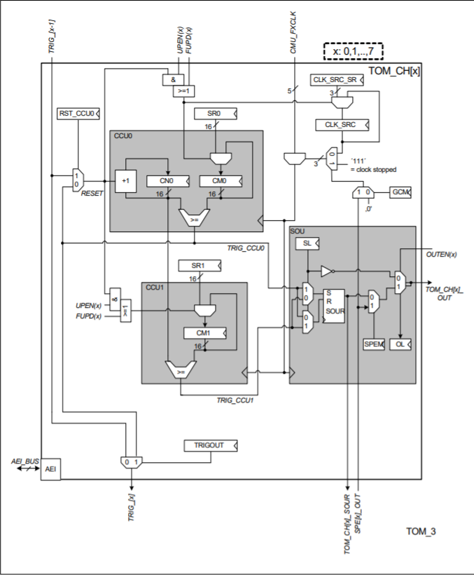
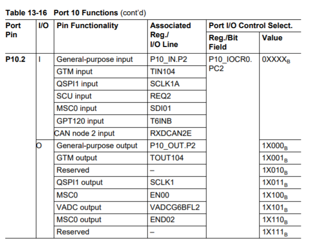
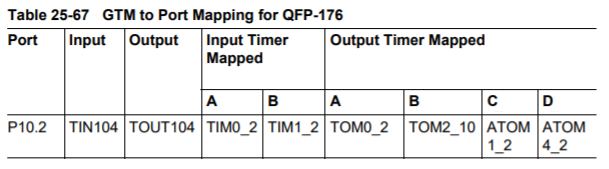

# Chronos ruler
## 시작하는 질문
 - Servo의 데이타시트를 찾아보니, on-time 값, 600 (즉, 1500 - 900) ~ 2400(1500 + 900) usec 범위로 디지탈 신호를 입력하여, Servo의 각도를 조정한다고 한다. 주기적으로 동작시켜야 하는데, 어떤 서브시스템으로 이 신호를 발생시키는 것이 좋을까?
 - pulse 신호를 발생시키면서, 주기(주파수)와 도통시간(on-time)을 바꿀 수 있으면 Application Kit 보드 위에 있는 Beeper 도 사용할 수 있겠다. 원격으로 동작 시킬 때 소리로 나에게 상태를 알려주는 방법중에 하나로 활용할 수 있겠네!   

 ("Chronos ruler(시간의 지배자)"라는 이번 절의 제목은 같은 이름의 애니메이션 시리즈에서 따왔습니다. 비슷한 성격의 시리즈물 중에 닥터후라는 영국드라마도 있지만, 닥터후는 시간 뿐만 아니라 공간도 이동을 해서 시간의 지배자를 선택했습니다.)

 제어공학, 신호처리를 배우면 아날로그 신호를 AD 변환기로 샘플링해서 디지탈로 바꾸고, 이정보를 활용해서 연산을 수행하고 DA 변환을 거쳐서 아날로그 신호로 만들어 출력한다고 배웁니다. 그런데 AURIX 메뉴얼을 열심히 찾아보아도 DA 변환기는 없습니다. 음성신호 등을 처리하는 몇몇 경우를 제외하고는 DA 변환기로 아날로그 신호를 복원하는 시스템은 없습니다. 대신 디지탈의 On, Off 상태를 사용하여 아날로그적인 정보를 처리하는 방법을 일반적으로 사용합니다.

## Objectives
 - Generic Timer Module (GTM) 이해
 - GTM 사용법 습득

## Example Description
 - 1ms 마다 timer interrupt를 발생시키고, Servo motor를 0도로 맞추도록 PWM을 발생시킬 수 있습니다.

## Background 정보
 - 타이머의 사용법 중에 Output Compare 활용 방법에 대한 일반론 설명은 어떨까?
 - 참고로 input capture 에 대한 일반론 설명은 WhereAreYou 를 참고하기 바랍니다.

## AURIX - related
 - Generic Timer Module (GTM)은 시간 관리 플랫폼입니다.
     - GTM을 구성하는 서브 모듈로는 TC237, TC275 공통적으로 Clock Management Module (CMU), Time Base Unit (TBU), Timer Input Module (TIM), Timer Output Module (TOM) 네 가지 모듈이 있고,   
     추가적으로 TC275의 경우 Advanced Routing Unit(ARU)와 ARU-connected Timer Output Module(ATOM)이 있습니다.
         - CMU와 TBU는 기준 시간을 생성하기 위한 모듈입니다.
         - TIM은 기준 시간을 활용하여 input capture 기능에 사용되는 모듈입니다.
         - TOM, ATOM은 기준 시간을 활용하여 output compare 기능을 수행하는 모듈입니다.
         - ARU는 GTM 모듈 내의 submodule끼리 데이터를 주고 받을 수 있도록 하는 모듈입니다.
     - 아래 그림은 TC237의 GTM module Block Diagram을 나타냅니다.
     

     - 아래 그림은 TC275의 GTM module Block Diagram을 나타냅니다.
     

 - Clock Management Module (CMU)
     - CMU는 counter와 GTM의 clock을 생성하는 것을 담당합니다.
     - CMU는 세가지의 subunits 들로 구성되며 서로 다른 clock을 생성할 수 있습니다.
     - Configurable Clock Generation (CFGU)
         - 8개의 clocks 을 출력할 수 있습니다.
         - TIM과 TBU에 사용됩니다.
         - 임의의 clock source를 선택할 수 있기 때문에 넓은 범위 내 기준 시간을 설정할 수 있습니다.
     - Fixed Clock Generation (FXU)
         - 5개의 clocks 을 출력할 수 있습니다.
         - 사전에 정의된 설정으로 clock을 생성합니다.
         - TOM에 사용됩니다.
     - External Clock Generation (EGU)
         - 3개의 external clocks을 출력할 수 있습니다.
     

- Time Base Unit (TBU)
     - TBU는 GTM을 위한 공용 기준 시간 (base timer)을 생성합니다.
     - 3개의 base timer가 있습니다.
     - TBU channel 0 time base register (TBU_CH0_BASE)는 27 bits이며 경우에 따라 상위 24 bit 또는 하위 24 bit 선택적으로 사용가능합니다.
     - TBU channel 1, 2 time base register (TBU_CH#_BASE)는 24 bits 입니다.
     - 각 base timer는 독립적으로 구동되나 global TBU channel enable을 통해 3개의 base timer를 동기화 할 수도 있습니다.
     

 - Timer Input Module (TIM)
     - TIM은 GTM의 입력 신호를 filtering 하거나 capturing하는 역할을 합니다.
     - 기본적으로 TIM은 입력 신호의 rising edge나 falling edge의 time stamp를 찍는 역할을 합니다. 동시에 signal level, edge 갯수, PWM 신호의 주기 등도 함께 측정 가능합니다.
     - 8개의 입력 채널이 있으며, 앞단에 TIM Filter Functionality (FLT)를 통해 rising edge, falling edge, 또는 모든 edge를 counting 할 건지 선택하게 됩니다.
     - Filtering 된 신호는 TIM_CH#에 들어가며 Timeout Detection Unit을 통해 time stamp를 찍게 됩니다.
     

 - Timer Output Module (TOM)
     - PWM을 생성하는 역할을 합니다.
     - 16개의 독립된 출력을 내보냅니다.
     - TGC0와 TGC1는 전체 출력을 제어합니다. PWM을 활성화시킬 지 말지, PWM 주기, DUTY cycle 등을 설정할 수 있습니다.
     - TOM Block Diagram
     
     
     - TOM Channel Architecture
     
         - Channel내의 CCU0안에는 선택한 CMU_FXCLK의 주파수로 올라가는 CN0(Counter)가 존재한다.
         - CN0(Counter)가 올라가면서 CM0와 CM1과 각각 비교하여 Period와 Duty Cycle이 결정된다.
         - CM0와 CN0가 같아질 때 한 주기의 PWM이 끝이나고, Reset된다.
         - CM1과 CN0가 같아질 때 DutyCycle이 끝이난다.
         - 참고로 CM0와 CM1값을 바꿀 때, 중간에 갑자기 바뀌어서 Pulse가 흐트러지지 않도록 Buffer에 저장해놓고, PWM 한주기가 끝나면 CM0와 CM1값을 변경하는데, 해당 Buffer는 Shadow Register라고 불리우며 각각 SR0, SR1이다.

 - Advanced Routing Unit (ARU)
     - GTM module 내의 submodule끼리 데이터를 주고 받을 수 있도록 하는 모듈입니다.
     - ARU를 통해 연결된 각각의 submodule들은 각자 고유의 write channel(data source)와 read channel(data destination)을 가지고 있습니다.
 
 - ARU-connected Timer Output Module (ATOM)
     - CPU의 작동없이 ARU와의 연결만으로도 출력 신호를 생산하는 모듈입니다.
     - 8개의 독립적인 출력을 가집니다.

## iLLD - related
 - Demo code description
     - Generic Timer module을 가지고 Period와 Duty 주기를 설정하여 원하는 주기 Pulse를 만들 수 있습니다.
     - GTM을 이용하여 Servo motor와 DCmotor를 구동시킬 수 있습니다.
 ### Module Configuration
 ```c
    void GtmTomTimer_initTimer(void)
    {
        {   /* GTM TOM configuration */
            IfxGtm_Tom_Timer_Config timerConfig;
            IfxGtm_Tom_Timer_initConfig(&timerConfig, &MODULE_GTM);
            timerConfig.base.frequency       = 100;         // Set PWM period
            timerConfig.base.isrPriority     = ISR_PRIORITY(INTERRUPT_TIMER_1MS);
            timerConfig.base.isrProvider     = ISR_PROVIDER(INTERRUPT_TIMER_1MS);
            timerConfig.base.minResolution   = (1.0 / timerConfig.base.frequency) / 1000;
            timerConfig.base.trigger.enabled = FALSE;
            timerConfig.clock                = IfxGtm_Tom_Ch_ClkSrc_cmuFxclk2;
    #if BOARD == APPLICATION_KIT_TC237
            timerConfig.tom                  = IfxGtm_Tom_1;            // Set TOM1 for TOM object
            timerConfig.timerChannel         = IfxGtm_Tom_Ch_7;         // Set Channel 7
            timerConfig.triggerOut           = &IfxGtm_TOM1_7_TOUT32_P33_10_OUT;    // Set p33.10 as output
    #elif BOARD == SHIELD_BUDDY
            timerConfig.tom                  = IfxGtm_Tom_0;            // Set TOM0 for TOM object
            timerConfig.timerChannel         = IfxGtm_Tom_Ch_12;                // Set Channel 12
            timerConfig.triggerOut           = &IfxGtm_TOM0_12_TOUT98_P11_9_OUT;    // Set p11.9 as output
    #endif
            timerConfig.base.trigger.outputEnabled      = TRUE;
            timerConfig.base.trigger.enabled            = TRUE;
            timerConfig.base.trigger.triggerPoint       = 150000/16/16; /* 1.5msec source: Fxclk1 100MHz/16 */
            timerConfig.base.trigger.risingEdgeAtPeriod = TRUE; /* Interrupt at rising edge */

            IfxGtm_Tom_Timer_init(&g_GtmTomTimer.drivers.timerOneMs, &timerConfig);

            IfxGtm_Tom_Timer_run(&g_GtmTomTimer.drivers.timerOneMs);
        }
    }

    void GtmTomServo_init(void)
    {
        /* disable interrupts */
        boolean  interruptState = IfxCpu_disableInterrupts();

        /** - GTM clocks */
        Ifx_GTM *gtm = &MODULE_GTM;
        g_GtmTomTimer.info.gtmFreq = IfxGtm_Cmu_getModuleFrequency(gtm);
        IfxGtm_enable(gtm);

        /* Set the global clock frequencies */
        IfxGtm_Cmu_setGclkFrequency(gtm, g_GtmTomTimer.info.gtmFreq);
        g_GtmTomTimer.info.gtmGclkFreq = IfxGtm_Cmu_getGclkFrequency(gtm);

        /** - Initialise the GTM part */
        GtmTomTimer_initTimer();

        printf("Gtm Tom Timer is initialised\n");

        /* enable interrupts again */
        IfxCpu_restoreInterrupts(interruptState);

        IfxGtm_Cmu_enableClocks(gtm, IFXGTM_CMU_CLKEN_FXCLK | IFXGTM_CMU_CLKEN_CLK0);
    }
 ```

 ### Interrupt Configuration
  - 1ms 마다 인터럽트를 발생시킨다.
    ```c
    void ISR_Timer_1ms(void)
    {
        IfxCpu_enableInterrupts();

        IfxGtm_Tom_Timer_acknowledgeTimerIrq(&g_GtmTomTimer.drivers.timerOneMs);
        g_GtmTomTimer.isrCounter.slotOneMs++;
    }
    ```

 ### Module Behavior
    ```c
    float32 onTime = 1.5;

    void GtmTomServo_run(void)
    {
        Ifx_TimerValue triggerPoint= (onTime * 100000) /16/16;
        IfxGtm_Tom_Timer_disableUpdate(&g_GtmTomTimer.drivers.timerOneMs);
        IfxGtm_Tom_Timer_setTrigger(&g_GtmTomTimer.drivers.timerOneMs, triggerPoint);
        IfxGtm_Tom_Timer_applyUpdate(&g_GtmTomTimer.drivers.timerOneMs);
    }
    ```
 - 위와 같이 GTM 설정을 마치면 아래 그림의 하얀색 박스 (P11.9)에서 PWM 신호를 출력하게 됩니다. 이 신호를 활용하여 servo motor를 다음 그림과 같이 연결하고 제어해보도록 합니다.
     - 하얀색 선: PWM 신호
     - 검정색 선: Ground
     - 빨간색 선: servo motor 전원 (3.3V)

     
     

## 변경실습 - LED의 밝기를 조절해보자.
 [Twinkle Twinkle Little Star](TwinkleTwinkleLittleStar.md)에서 LED의 Port의 ON/OFF를 설정하여 LED를 깜빡여보았다. 이를 PWM을 이용하면 LED의 밝기를 조절하며 깜빡일 수 있다. 해당 실습은 Servo Motor가 없을 때 PWM 실습을 위하여 진행해보자.   

### Reference
 - iLLD User Documentation - Modules/iLLD/GTM/TOM_Interface_Drivers/TOM_PWM_Interface_Drivers/How_to_use_GTM_TOM_PWM_Driver

### iLLD - related
 Aurix Tutorial에 나온 코드와는 다르게 iLLD의 GTM TOM에 보면 pwm driver가 존재한다. 이를 사용하여 PWM을 만들어 보았다.

#### How to use the GTM TOM PWM Driver
 - Preparation
     - Include Files : Include following header file into your C code
    ```c
    #include <Gtm/Tom/Pwm/IfxGtm_Tom_Pwm.h>
    ```

     - Variables : define global variables if necessary
    ```c
    Ifx_GTM *gtm = &MODULE_GTM;
    #define TOM0_CH0_PRIO 10
    ```
    
     - Interrupts : define Interrupts if needed
    ```c
    IFX_INTERRUPT(TOM0Ch0_ISR, 0, TOM0_CH0_PRIO)
    {}
    ```

    - Initialization
    ```c
    // install interrupt handlers
    IfxCpu_Irq_installInterruptHandler (TOM0Ch0_ISR, TOM0_CH0_PRIO);
    // enable GTM clock
    {
        float32 frequency = IfxGtm_Cmu_getModuleFrequency(gtm);
        // Enables the GTM
        IfxGtm_enable(gtm);
        // Set the global clock frequency to the max
        IfxGtm_Cmu_setGclkFrequency(gtm, frequency);
        // Set the CMU CLK0
        IfxGtm_Cmu_setClkFrequency(gtm, IfxGtm_Cmu_Clk_0, frequency);
        // FXCLK: used by TOM and CLK0: used by ATOM
        IfxGtm_Cmu_enableClocks(gtm, IFXGTM_CMU_CLKEN_FXCLK | IFXGTM_CMU_CLKEN_CLK0);
    }
    // initialize TOM
    IfxGtm_Tom_Pwm_Config tomConfig;    \\configuration structure
    IfxGtm_Tom_Pwm_Driver tomHandle;    \\ handle
    IfxGtm_Tom_Pwm_initConfig(&tomConfig, gtm);
    tomConfig.tomChannel  = IfxGtm_Tom_Ch_0;
    tomConfig.period                = 20;
    tomConfig.dutyCycle             = 10;
    tomConfig.interrupt.ccu0Enabled = TRUE;
    tomConfig.interrupt.isrPriority = TOM0_CH0_PRIO;
    tomConfig.pin.outputPin = &IfxGtm_TOM0_0_TOUT106_P10_4_OUT;
    IfxGtm_Tom_Pwm_init(&tomHandle, &tomConfig);
    ```
 TOM will be now generating a PWM signal on the selected port pin while generating selected interrupt according to above configured period and duty cycle.

#### Port Configuration
 - LED port : P10.2
 

 - 사용해야할 TOM : TOM0, Channel2
 

 - Code에서 수정
```c
g_GtmTom_Pwm.config.gtm                      = &MODULE_GTM;
g_GtmTom_Pwm.config.tom                      = IfxGtm_Tom_0;
g_GtmTom_Pwm.config.tomChannel               = IfxGtm_Tom_Ch_2;
// tomConfig.pin.outputPin = &IfxGtm_TOM0_0_TOUT106_P10_4_OUT;          // Wrong!
tomConfig.pin.outputPin = &IfxGtm_TOM0_2_TOUT104_P10_2_OUt;             // P10.2로 교체!
// g_GtmTom_Pwm.config.interrupt.isrPriority    = ISR_PRIORITY_TOM0_CH2;// Interrupt사용시 설정할 것! 
```
## 마치며...
 이처럼 시간과 관련된 신호를 발생해여 정보를 입출력하는 방법은 마이크로컨트롤러에서 가장 일반적으로 사용하는 입출력 방법입니다. 특히 전력전자 분야에서는 PWM 이라 불리는 방법을 적극적으로 활용하고 있습니다 (PWM의 구체적인 활용 및 내용은 Synchronized PWM 절에서 다루겠습니다.) 출력 신호 뿐만 아니라 특정 이벤트의 발생 여부 등을 감지하기 위해서도 시간과 관련되 디지탈 신호를 일반적으로 사용하고 있습니다. 그 전형적인 활용예가 Where are you? 절의 엔코더 신호의 인터페이스와 활용입니다.   

 시간과 관련된 디지탈 신호를 잘 다룰 수 있게 되면, 마이크로컨트롤러의 지배자 가 될 수 있습니다.