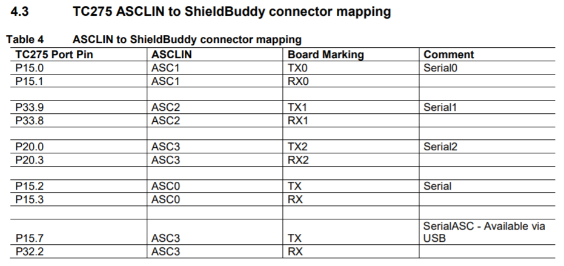
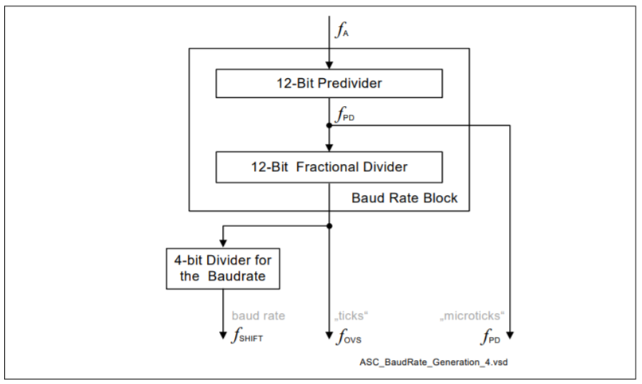
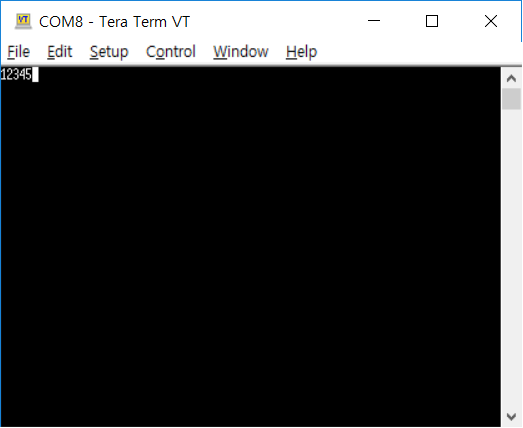
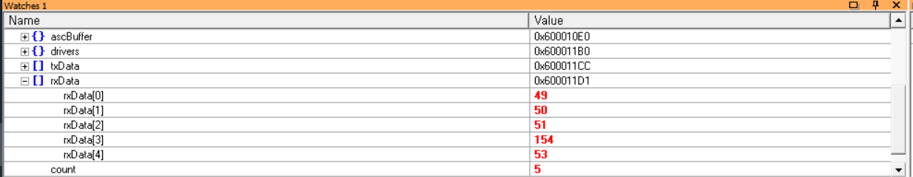
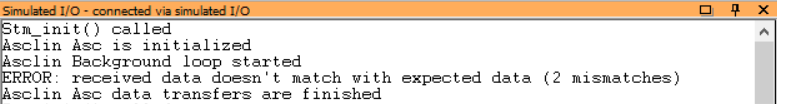

# Hello World
## Objectives
- Asclin를 이용한 직렬통신 구현
- 외부 터미널을 통한 입력과 출력의 확인

## Example Description
- 터미널을 통해 다음의 기능이 동작하는지 확인한다.
  - 프로그램 시작 시 '12345'라는 문자열을 출력
  - 메세지를 5개 입력받을 때마다 입력받은 데이터를 출력
  - 디버거의 Simulated IO를 통해 다음 기능이 동작하는지 확인한다.
- 일치 여부에 따라 error 또는 성공 메세지를 출력

## AURIX -related
### Asclin ( Asynchronous/Synchronous Interface )
- 빠르고(fast) 유연한(flexible) 직렬(serial) 통신 인터페이스 구축을 위한 모듈로   
  어떠한 signal들을,   
  어떠한 protocol을 통해서,   
  어떠한 sequence로 데이터를 처리할지를 결정해 준다.   
- AURIX의 Module은 구성은 다음과 같음   
  

### Signals
- Asclin의 signal 들은 다음과 같이 data 통신에 관한 signal,
  - ARX  : Receive data input
  - ATX  : Transmit data output
  - ARTS : Request to send handshake output
  - ACTS : Clear to send handshake input
- Module에 관한 signal이 존재
  - ASLSO : Slave select signal output
  - ASCLK : Serial clock output
  
### Protocols
사람과 다르게 기계들의 통신은 명확하게 미리 정한 약속에 따라 진행이 되며, 이 약속을 통신 Protocol 이라고 한다.
- Asclin은 다음과 같은 protocol들을 제공
  - ASC: 일반적인 Asclin 통신 프로토콜 (본 예제에서 사용)
  - LIN: Local interconnect network, 차량에서 느린 속도로 data를 전송할 때 사용
  - SPI: Serial Peripheral Interface, 동기화된 병렬통신을 이용할 때 사용
  
### Sequences
직렬통신은 한 번에 data를 한 bit씩 밖에 전송을 못 하기 때문에, 전송하고자 하는 data를 순차적으로 관리해 주는 것이 필요하며, Asclin은 먼저 들어온 data를 먼저 내보내는 FIFO 방식(First-In-First-Out)을 사용한다.    
- 아래 그림은 TX FIFO(Transmit First-In-First-Out)의 처리 구조   
  

### Communication process
- Data를 수신할 때
  1. 입력 데이터가 들어옴 (ARX)
  2. Robust한 통신을 위한 필터링 (Filter, Oversampling, Decimate)
  3. FIFO기반 unpackaging (RxFIFO)
  4. handshake 요청에 답변 (ARTS; Request to send handshake output)
  
- Data를 송신할 때
  1. 송신하려는 데이터가 들어옴 (ATX)
  2. FIFO기반 packaging (TxFIFO)
  3. handshake 응답을 기다림 (ACTS; Clear to send handshake input)

- Handshake
  - Data를 송수신할때 통신이 가능한지 상태를 주고받아 원활한 통신을 가능하게 한다.
  - 수신기 : RTS(Request to send handshake output)라는 자신의 수신버퍼 상태를 알려주는 신호   
             → 수신버퍼가 일정 Threshold을 넘어가면 OFF되고, 다시 Threshold 미만으로 떨어지면 ON됨
  - 송신기 : 수신기의 RTS신호를 CTS(Clear to send handshake input)에 받아서 송신을 일시정지 혹은 다시 시작한다.
  - 이런 신호들을 주고 받는 행위을 handshake라고 한다.
  - 받는쪽에서 받을 준비가 됬음을 RTS(Request to send handshake output)를 통해서 알리고,
  - 송신쪽에서 그 신호를 받았음을 CTS(Clear to send handshake input)를 통해 응답한다.

- Interrupt
  - 비동기 직렬통신이기 때문에 언제 data 전송이 일어날지 알 수 없음
  - 때문에 인터럽트를 이용해 비동기 통신에 대응한다.
  - 인터럽트를 발생시킨 후 data 처리을 위한 작업을 진행

## iLLD - related
### Module Configuration
- Asclin의 모듈 초기화
  - 사용할 protocol(AsclinAsc; uart)을 정하고 (TC23A: module 0, TC27D: module 3),
    - UART : Universal asynchronous receiver/transmitter(범용 비동기화 송수신기)   
      병렬 데이터의 형태를 직렬 방식으로 전환하여 데이터를 전송하는 컴퓨터 하드웨어의 일종이다.
      
  - 송수신이 일어날 물리적 pin(TC23A: P14.0, 14.1, TC27D: P32.2, 15.7)을 고른다.
    (이번 예제의 경우 USB로 컴퓨터와 연결하여 콘솔과 통신할 것이므로 TC27D의 경우 ASCLIN의 ASC3을 쓴다)
    
  
  - Data 전송 속도를 정한 뒤, (AURIX와 통신을 진행하는 기기와 동일하게 맞춤)
    * Baudrate(보 레이트)
      - 1초당 변조 횟수 혹은 심볼(Symbol, 의미 있는 데이터 묶음)개수; 이론적인 통신 단위로 초당 신호(Signal) 요소의 수를 나타낸다.
      - 예를 들어 의미 있는 데이터 묶음이 8bit이고 BPS(Bit per second)가 9600bps라면, Baud rate는 1200 Baud로 표현할 수 있다.
      - Clock System of Asclin
        

        - Baudrate Configuration - 레지스터
          - BITCON.PRESCALER - the division ratio of the predivider
          - BRG.NUMERATOR - the nominator of the fractional divider
          - BRG.DENOMINATOR - the denominator of the fractional divider
          - BITCON.OVERSAMPLING - the division ratio of the baudrate post divider

        - Frequencies
          - f_A = bit field <code>CSR.CLKSEL</code>에 의해 결정되는 Clock System의 Clock Source, SPB(System Peripheral Bus) clock에 독립적으로 사용된다.
          - f_PD = f_A / (BITCON.PRESCALER + 1)            → Pre-Divided clock
          - f_OVS = f_PD * BRG.NUMERATOR / BRG.DENOMINATOR → Over Sampling Clock
          - f_SHIFT = f_OVS / (BITCON.OVERSAMPLING + 1)    → Baud Rate
  - 통신관련 Interrupt 설정
    - TX - Transmit Interrupt
    - RX - Receive Interrupt
    - EX - Extended Error Interrupt


```c
void AsclinAscDemo_init(void)
{
    //...
    // create module config
    #if BOARD == APPLICATION_KIT_TC237
        IfxAsclin_Asc_initModuleConfig(&ascConfig, &MODULE_ASCLIN0);
    #elif BOARD == SHIELD_BUDDY
        IfxAsclin_Asc_initModuleConfig(&ascConfig, &MODULE_ASCLIN3);
    #endif

    // set the desired baudrate
    ascConfig.baudrate.prescaler    = 1;
    ascConfig.baudrate.baudrate     = 115200;
    ascConfig.baudrate.oversampling = IfxAsclin_OversamplingFactor_4;

    // ISR priorities and interrupt target
    #if BOARD == APPLICATION_KIT_TC237
        /* ISR priorities and interrupt target */
        ascConfig.interrupt.txPriority    = ISR_PRIORITY_ASC_0_TX;
        ascConfig.interrupt.rxPriority    = ISR_PRIORITY_ASC_0_RX;
        ascConfig.interrupt.erPriority    = ISR_PRIORITY_ASC_0_EX;
    #elif BOARD == SHIELD_BUDDY
        ascConfig.interrupt.txPriority    = ISR_PRIORITY_ASC_3_TX;
        ascConfig.interrupt.rxPriority    = ISR_PRIORITY_ASC_3_RX;
        ascConfig.interrupt.erPriority    = ISR_PRIORITY_ASC_3_EX;
    #endif
    ascConfig.interrupt.typeOfService = (IfxSrc_Tos)IfxCpu_getCoreIndex();

    // FIFO configuration
    ascConfig.txBuffer     = g_AsclinAsc.ascBuffer.tx;
    ascConfig.txBufferSize = ASC_TX_BUFFER_SIZE;

    ascConfig.rxBuffer     = g_AsclinAsc.ascBuffer.rx;
    ascConfig.rxBufferSize = ASC_RX_BUFFER_SIZE;

    // pin configuration
#if BOARD == APPLICATION_KIT_TC237
    const IfxAsclin_Asc_Pins pins = {
        NULL_PTR,                     IfxPort_InputMode_pullUp,        /* CTS pin not used */
        &IfxAsclin0_RXA_P14_1_IN, IfxPort_InputMode_pullUp,        /* Rx pin */
        NULL_PTR,                     IfxPort_OutputMode_pushPull,     /* RTS pin not used */
        &IfxAsclin0_TX_P14_0_OUT, IfxPort_OutputMode_pushPull,     /* Tx pin */
        IfxPort_PadDriver_cmosAutomotiveSpeed1
    };
#elif BOARD == SHIELD_BUDDY
    const IfxAsclin_Asc_Pins pins = {
        NULL_PTR,                     IfxPort_InputMode_pullUp,        /* CTS pin not used */
        &IfxAsclin3_RXD_P32_2_IN, IfxPort_InputMode_pullUp,        /* Rx pin */
        NULL_PTR,                     IfxPort_OutputMode_pushPull,     /* RTS pin not used */
        &IfxAsclin3_TX_P15_7_OUT, IfxPort_OutputMode_pushPull,     /* Tx pin */
        IfxPort_PadDriver_cmosAutomotiveSpeed1
    };
#endif
    ascConfig.pins = &pins;

    // initialize module
    IfxAsclin_Asc_initModule(&g_AsclinAsc.drivers.asc0, &ascConfig);
    // ...
}
```

### Interrupt Configuration
- 통신 간 데이터 송수신을 위한 인터럽트를 등록한다.
```c
// in ConfigurationIsr.h
#define ISR_PRIORITY_ASC_0_RX 4
#define ISR_PRIORITY_ASC_0_TX 5
#define ISR_PRIORITY_ASC_0_EX 6

#define ISR_PROVIDER_ASC_0    IfxSrc_Tos_cpu0

#define INTERRUPT_ASC_0_RX    ISR_ASSIGN(ISR_PRIORITY_ASC_0_RX, ISR_PROVIDER_ASC_0)
#define INTERRUPT_ASC_0_TX    ISR_ASSIGN(ISR_PRIORITY_ASC_0_TX, ISR_PROVIDER_ASC_0)
#define INTERRUPT_ASC_0_EX    ISR_ASSIGN(ISR_PRIORITY_ASC_0_EX, ISR_PROVIDER_ASC_0)

// in AsclinAscDemo.c
IFX_INTERRUPT(asclin0TxISR, 0, ISR_PRIORITY_ASC_0_TX)
{
    IfxAsclin_Asc_isrTransmit(&g_AsclinAsc.drivers.asc0);
}

IFX_INTERRUPT(asclin0RxISR, 0, ISR_PRIORITY_ASC_0_RX)
{
    IfxAsclin_Asc_isrReceive(&g_AsclinAsc.drivers.asc0);
}

IFX_INTERRUPT(asclin0ErISR, 0, ISR_PRIORITY_ASC_0_EX)
{
    IfxAsclin_Asc_isrError(&g_AsclinAsc.drivers.asc0);
}
```

### Module Behavior
- 통신 검증을 위한 test function 구성
  - <code>IfxAsclin_Asc_write</code>을 통한 데이터 송신
  - <code>IfxAsclin_Asc_read</code>을 통한 데이터 수신
  - 입출력 데이터를 비교하여 메세지 출력
```c
// in AsclinAscDemo.c
void AsclinAscDemo_run(void)
{
    uint32 i, errors = 0;
    g_AsclinAsc.count = 5;

    for (i = 0; i < g_AsclinAsc.count; ++i)
    {
        /* 원본 Demo Code */
//      g_AsclinAsc.txData[i] = i + '1';    // {'1', '2', '3' ,'4' ,'5'}

/*      
**      Terminal에 출력되는 것은 ASCII코드 기준이므로 위의 Demo코드로 진행하였을 때, 
**      TeraTerm에 1 2 3 4 5가 출력이 안되는 문제가 발생된다.
**      따라서 ASCII코드 기준의 1,2,3,4,5가 출력될 수 있도록 코드를 수정하여야 한다.
*/
        g_AsclinAsc.txData[i] = i + '49';    // ASCII Code 기준{'1', '2', '3' ,'4' ,'5'}
        g_AsclinAsc.rxData[i] = 0;
    }

    IfxAsclin_Asc_write(&g_AsclinAsc.drivers.asc0, g_AsclinAsc.txData, &g_AsclinAsc.count, TIME_INFINITE);
    IfxAsclin_Asc_read(&g_AsclinAsc.drivers.asc0, g_AsclinAsc.rxData, &g_AsclinAsc.count, TIME_INFINITE);

    // check received data
    for (i = 0; i < 5; ++i)
    {
        if (g_AsclinAsc.rxData[i] != g_AsclinAsc.txData[i])
        {
            ++errors;
        }
    }

    if (errors)
    {
        IfxAsclin_Asc_write(&g_AsclinAsc.drivers.asc0, g_AsclinAsc.rxData, &g_AsclinAsc.count , TIME_INFINITE);
        printf("ERROR: received data doesn't match with expected data (%lu mismatches)\n", errors);
    }
    else
    {
        IfxAsclin_Asc_write(&g_AsclinAsc.drivers.asc0, g_AsclinAsc.rxData, &g_AsclinAsc.count , TIME_INFINITE);
        printf("OK: received data matches with expected data\n");
    }

    //...
}
```

## 추가적인 설명
### Terminal을 통한 송수신 확인
- Teraterm을 실행하여 board가 연결된 port와 connect


- Serial 통신을 위한 설정이 필요 (Setup > Serial port)


- Board에서 설정한 통신 스펙과 맞춰준다. (baud rate만 바꾸면 됨)


- <code>IfxAsclin_Asc_write</code>로 보낸 데이터가 출력되는 것을 확인할 수 있다.


### Simulated I/O를 통한 메세지 확인
- 만약 board와 디버거가 연결되어 실행되고 있다면 설정해둔 <code>printf()</code> 메세지가 출력되는 것을 확인할 수 있다.


---
## 실습 실행 결과
- 원본 코드 Data 송신 문제 해결
  ```c
  // in AsclinAscDemo.c
  void AsclinAscDemo_run(void)
  {
      uint32 i, errors = 0;
      g_AsclinAsc.count = 5;

      for (i = 0; i < g_AsclinAsc.count; ++i)
      {
          /* 원본 Demo Code */
  //      g_AsclinAsc.txData[i] = i + 1;    // {'1', '2', '3' ,'4' ,'5'}

  /*      
  **      Terminal에 출력되는 것은 ASCII코드 기준이므로 위의 Demo코드로 진행하였을 때, 
  **      TeraTerm에 1 2 3 4 5가 출력이 안되는 문제가 발생된다.
  **      따라서 ASCII코드 기준의 1,2,3,4,5가 출력될 수 있도록 코드를 수정하여야 한다.
  **      g_AsclinAsc.txData[i] = i + 1;에서 1이 아니라 '1'혹은 ASCII코드 기준 49를 더해주는 것으로 수정해주어야 한다.
  */
          g_AsclinAsc.txData[i] = i + '1';    // ASCII Code 기준{'1', '2', '3' ,'4' ,'5'}
          g_AsclinAsc.rxData[i] = 0;
      }

      IfxAsclin_Asc_write(&g_AsclinAsc.drivers.asc0, g_AsclinAsc.txData, &g_AsclinAsc.count, TIME_INFINITE);
      IfxAsclin_Asc_read(&g_AsclinAsc.drivers.asc0, g_AsclinAsc.rxData, &g_AsclinAsc.count, TIME_INFINITE);
      //...
  }
  ```

- Tera Term을 통한 Data 송신확인   
  

- Tera Term을 통한 Data 수신확인   
     
  수신의 경우 rxData가 중간에 다른 값이 받아지는 경우가 생기는데 명확한 이유를 모르겠다.   
  (추측하기로 UDE에서 실행했을 때 UDE가 asclin에 영향을 주는 것 같다고 염형이 말했었던걸로 보아, 그것과 관련된 문제가 아닐지 추측된다)   

- Simulated I/O를 통한 메세지 확인    
  
